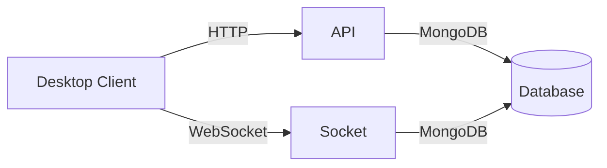

# fydne.app-2023 🌵

[](https://github.com/Shiro-nn/fydne.app-2023/stargazers)
[](https://github.com/Shiro-nn/fydne.app-2023/network/members)
[](https://github.com/Shiro-nn/fydne.app-2023/issues)
[](https://github.com/Shiro-nn/fydne.app-2023/commits)
[](LICENSE)
[](https://github.com/Shiro-nn/fydne.app-2023)


> **fydne.app-2023** — старое приложение на Electron для одноименного проекта. 🌵 Дизайн неполный, но красивый. До конца не доделал, нужды в этом не было. Репозиторий переведён в архивный режим, код доступен "как есть" для ознакомления и экспериментов.

---

## 📂 Состав репозитория

Репозиторий содержит исходный код приложения, разделённый на три основные части, согласно diff.txt:

| Директория   | Описание                                                                 |
|--------------|-------------------------------------------------------------------------|
| **`api`**    | RESTful API на Node.js (`fastify`, `mongoose`) для взаимодействия с MongoDB и WebSocket. |
| **`desktop`**| Клиентское приложение на Electron с фронтендом (HTML, CSS, JS) и серверной логикой.      |
| **`socket`** | WebSocket-сервер на Node.js (`socket.io`) для real-time обновлений и сессий.            |

> **Примечание:** Компоненты связаны между собой, но проект не завершен, поэтому функциональность ограничена.

---

## 🚀 Быстрый старт (локально)

### Установка и запуск desktop

1. Клонируйте репозиторий:
   ```bash
   git clone https://github.com/Shiro-nn/fydne.app-2023.git
   cd fydne.app-2023/desktop
   ```

2. Установите зависимости:
   ```bash
   npm install
   ```

3. Запустите приложение:
   ```bash
   npm test  # Использует "electron ." из package.json
   ```

> **Важно:** Для работы API и WebSocket требуется MongoDB и настройка `config.js` в `api` и `socket`.

### Запуск API

1. Перейдите в директорию:
   ```bash
   cd ../api
   ```

2. Установите зависимости:
   ```bash
   npm install
   ```

3. Настройте `config.js` (укажите MongoDB URI) и запустите:
   ```bash
   node init.js  # Слушает на localhost:4524
   ```

### Запуск WebSocket

1. Перейдите в директорию:
   ```bash
   cd ../socket
   ```

2. Установите зависимости:
   ```bash
   npm install
   ```

3. Настройте `config.js` и запустите:
   ```bash
   node init.js  # Слушает на localhost:4964
   ```

---

## 🧩 Архитектура проекта



- **Desktop**: Electron-приложение с интерфейсом (HTML, CSS, JS) и локальным сервером (порт 35621).
- **API**: Обеспечивает endpoints, такие как `/token/validate`, `/trade/stats`, и кэшированные данные.
- **Socket**: Real-time обновления через `socket.io`, включая сессии и данные пользователя.

---

## 🛠️ Системные требования

- **Node.js 18+** для `api` и `socket`.
- **Electron 25+** для `desktop`.
- **MongoDB 6+** для хранения сессий и статистики.

---

## 📸 Скриншоты


---

## ⚖️ Лицензия

Код распространяется под лицензией **MIT**. Используйте свободно, но без гарантий.

---

## 🤝 Вклад

Репозиторий **архивирован**, PR не принимаются. Форкайте и экспериментируйте с кодом для своих целей.
